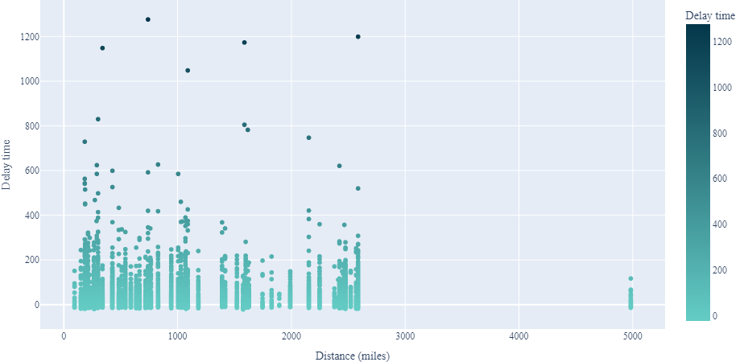
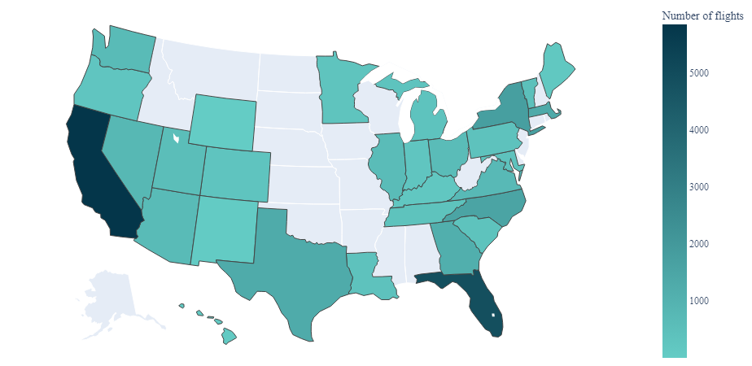
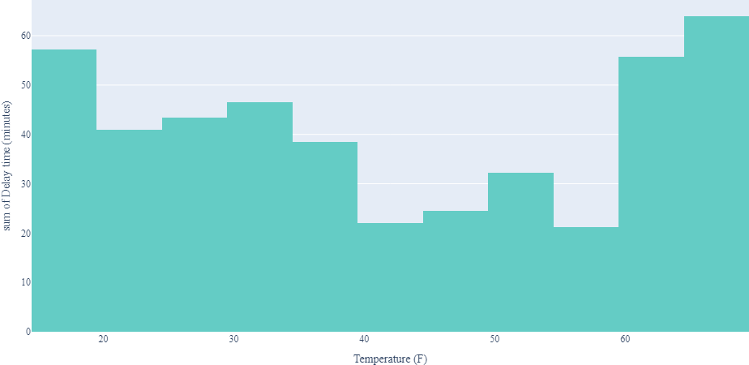
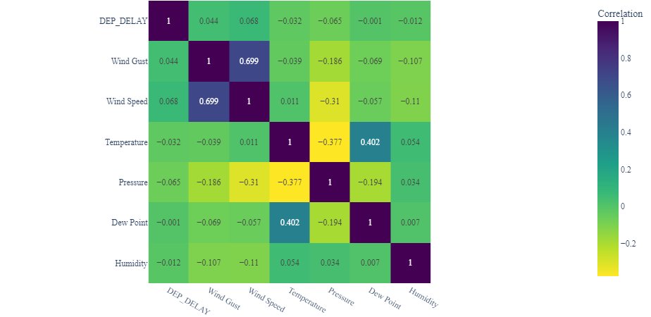
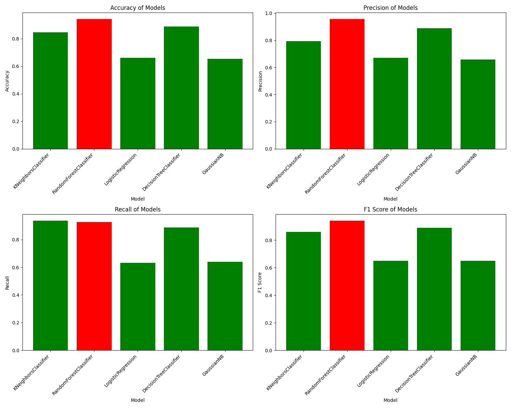
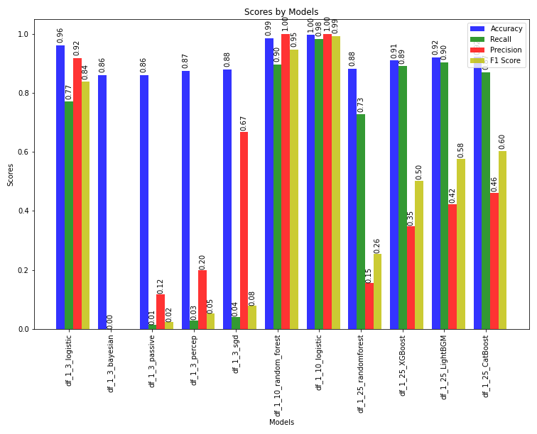
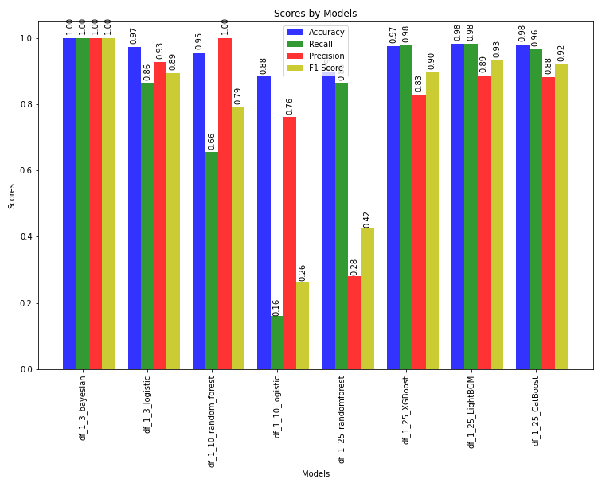
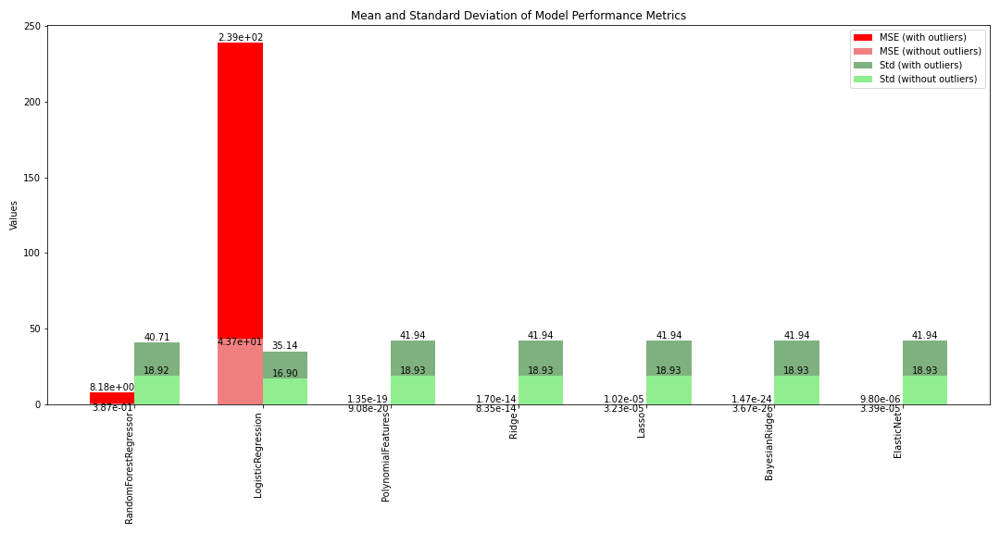

# Delayma: A Comprehensive Approach to Accurate Flight Delay Forecasting

### Authors:

- [Anirudh S. Kumar](https://github.com/Anirudh-S-Kumar)
- [Prakhar Gupta](https://github.com/Prakhar-Gupta-03)
- [Sahil Saraswat](https://github.com/sahilence)
- [Vartika](https://github.com/Vartika2401)

## Table of Contents

- [Motivation](#motivation)
- [Related Work](#related-work)
- [Dataset Details](#dataset-details)
  - [Insights from the dataset](#insights-from-the-dataset)
  - [How we used the dataset](#how-we-used-the-dataset)
- [Data Pre-processing](#data-pre-processing)
- [Methodology](#methodology)
  - [Baseline for classification](#baseline-for-classification)
  - [Classification](#classification)
  - [Regression](#regression)
- [Results](#results)
- [Conclusion and Future Work](#conclusion-and-future-work)
- [References](#references)

## Motivation

Flight delays have long been a centre of uncertainty in the aviation industry, having widespread effects on the aviation industry and passengers. It is a critical concern within the aviation industry, impacting passenger satisfaction, operational costs, and overall system efficiency. Prediction of delay can have far-reaching consequences on the entire industry and is of huge economic importance.

Accurately predicting flight delays is a crucial point of research as it is affected by various factors such as weather, air traffic congestion, logistic complexities, festivities, and economics. Developing reliable prediction models can revolutionize how airlines manage their schedules and how passengers plan their journeys. This study aimed to create a modern ML model which can accurately predict delays based on- season, time, location, etc. For this study, we used various datasets and intend to employ relevant ML algorithms to correctly predict delays, coupled with relevant visualization analysis and data engineering techniques.

## Related Work

Several attempts have been made before to predict flight delays.

- **Jia Yi and team**[^1] developed a classifier where a delay is defined as an arrival or departure 15 minutes later than scheduled. They utilized a two-layer stacking algorithm. The first layer learners comprised KNN, Random Forest, Logistic Regression, Decision Tree, and Gaussian Naive Bayes, while the second layer learner was a Logistic Regression model. For feature selection, they employed the Boruta algorithm. The stacking algorithm surpassed all single-level learners in performance metrics such as accuracy, precision, recall, and F1 score. The Random Forest classifiers were the closest in performance to the stacking algorithm among all the algorithms. The classifier achieved an accuracy of 0.82 with the stacking algorithm.

- **Esmaeilzadeh and Mokhtarimousavi**[^2] conducted an experiment using Support Vector Machines to investigate the non-linear correlation between instances of flight delays. Their study was limited to 20 days in 2018 and focused on three major airports in New York City. Their research indicated that elements such as pushback delay, taxi-out delay, the ground delay program, and demand-capacity imbalance, with respective probabilities of 0.506, 0.478, 0.339, and 0.338, significantly impact the delay of flight departures.

- **Zhang and Ma**[^3] undertook a project to categorize flight departure delays into three distinct groups: under 15 minutes, between 15 and 60 minutes, and over 60 minutes. They combined a flight dataset with a weather dataset, resulting in 260k samples. The selection of features was done manually. They applied the CatBoost algorithm, which leverages gradient boosting on decision trees. The learning process was executed on the GPU, while the scoring algorithm was run on the CPU. The model's accuracy was recorded at 0.77.

- **Tang**[^4] tried to classify flights into two categories: delayed (if the departure was delayed by 15 minutes or more) and on-time. The data used for this project was collected from JFK Airport from November 2019 to December 2020. A variety of machine learning algorithms were tested using tenfold cross-validation, including Logistic Regression, KNN, Gaussian Naïve Bayes, Decision Trees, SVM, Random Forest, and Gradient Boosted Trees, all with their default parameters from sci-kit-learn. The Decision Trees algorithm emerged as the top performer, achieving an accuracy of 0.977, closely followed by Gradient Boosted Trees.

[^1]: Yi et al., [Link to Paper](citation_link_1)
[^2]: Esmaeilzadeh and Mokhtarimousavi, [Link to Paper](citation_link_2)
[^3]: Zhang and Ma, [Link to Paper](citation_link_3)
[^4]: Tang, [Link to Paper](citation_link_4)

## Dataset Details

The dataset source is taken from a [kaggle dataset](https://www.kaggle.com/datasets/threnjen/2019-airline-delays-and-cancellations), which contains information about flights that took off from JFK Airport between November 2019 and January 2020.

### Insights from the dataset

- Except for a handful of anomalies, there doesn't appear to be a significant relationship between distance and delay.

- Upon examining the most frequently visited destination states, we find California, Florida, and New York at the top. This aligns with the fact that these states are among the most populated in the U.S. Interestingly, despite being located across the country, the two most popular cities are based in California.

- Severe weather circumstances, such as exceptionally high or low temperatures, can lead to flight delays. This is understandable, as such extreme weather can pose challenges for the aircraft and the airport operations.

- Despite our initial suggestion that there might be a connection between temperature and delay, the correlation is not particularly robust. Indeed, the relationship between any weather condition and delay is relatively weak.

### How we used the dataset

The `DEP_DELAY` column in the datasets used for Classification was transformed into binary classes. A flight was marked as delayed if the departure time was more than 15 minutes later than scheduled.

To make the classification task more manageable, we started with a smaller subset of the problem before expanding to the larger one. To proceed, four sub-datasets were created from this.

- **df_1_3** - Dataset with top 3 most frequent destinations.
- **df_1_10** - Dataset with top 10 most frequent destinations.
- **df_1_25** - Dataset with top 25 most frequent destinations.
- **df_preprocessed** - Dataset with all destinations.

In the context of the regression problem, the `DEP_DELAY` column was utilized in its original form.

- **m1_final_regression_dataset** - Dataset with all destinations for regression.

## Data Pre-processing

Basic preprocessing, which was done on the complete dataset:

1. The `Condition` attribute originally contained 25 unique conditions. Some data entries had multiple conditions listed in the `Condition` field. We first carried out an encoding process akin to label encoding but in a monotonically increasing manner. For instance, various types of cloudiness, like _mostly cloudy_ and _partly cloudy_ were assigned the numbers 2 and 1, respectively. Each condition was allocated its column, leading to the creation of 9 additional columns and the removal of the original `Condition` column.

2. Attributes such as day, month, hour, and minute exhibit cyclical behaviour. We employ a technique known as **cyclic feature engineering** to capture this periodicity. This method involves mapping each cyclical attribute onto a circle, ensuring the preservation of its periodic characteristics. As a result, we applied cyclic feature engineering to the `MONTH`, `DAY_OF_WEEK`, and `DAY_OF_MONTH` columns.

We initially tackled a less complex subset of the problem to streamline the problem-solving process. This approach allowed us to scale up our efforts gradually. Consequently, we partitioned the original dataset into four distinct, manageable sub-datasets.

Datasets used for Classification had their `DEP_DELAY` column converted to binary classes based on delay, where delay is true if the departure time delay exceeds 15 minutes.

| Feature             | Format    | Description                                     |
| ------------------- | --------- | ----------------------------------------------- |
| `MONTH           `  | `int64  ` | month                                           |
| `DAY_OF_MONTH    `  | `int64  ` | date on which flight departed                   |
| `DAY_OF_WEEK     `  | `int64  ` | day number of the week on which flight departed |
| `OP_UNIQUE_CARRIER` | `object ` | Carrier Code                                    |
| `TAIL_NUM        `  | `object ` | Airflight Number                                |
| `DEST            `  | `object ` | Destination                                     |
| `DEP_DELAY       `  | `float64` | Departure delay of the flight                   |
| `CRS_ELAPSED_TIME`  | `int64  ` | Scheduled journey time of the flight            |
| `DISTANCE        `  | `int64  ` | Distance of the flight                          |
| `CRS_DEP_M       `  | `int64  ` | Scheduled Departure Time                        |
| `CRS_ARR_M       `  | `int64  ` | Scheduled Arrival Time                          |
| `Temperature     `  | `int64  ` | Temperature                                     |
| `Dew Point       `  | `object ` | Dew Point                                       |
| `Humidity        `  | `int64  ` | Humidity                                        |
| `Wind            `  | `object ` | Wind type                                       |
| `Wind Speed      `  | `int64  ` | Wind speed                                      |
| `Wind Gust       `  | `int64  ` | Wind Gust                                       |
| `Pressure        `  | `float64` | Pressure                                        |
| `Condition       `  | `object ` | Condition of the climate                        |
| `sch_dep         `  | `int64  ` | No. of flights scheduled for arrival            |
| `sch_arr         `  | `int64  ` | No. of flights scheduled for departure          |
| `TAXI_OUT        `  | `int64  ` | Taxi-out time                                   |
| `Cloudy          `  | `int64  ` | Cloudy intensity                                |
| `Windy           `  | `int64  ` | Windy intensity                                 |
| `Fair            `  | `int64  ` | Fair intensity                                  |
| `Rain            `  | `int64  ` | Rain intensity                                  |
| `Fog             `  | `int64  ` | Fog intensity                                   |
| `Drizzle         `  | `int64  ` | Drizzle intensity                               |
| `Snow            `  | `int64  ` | Snow intensity                                  |
| `Wintry Mix      `  | `int64  ` | Wintry Mix intensity                            |
| `Freezing Rain   `  | `int64  ` | Freezing Rain intensity                         |
| `MONTH_sin       `  | `float64` | Sin value of month                              |
| `MONTH_cos       `  | `float64` | Cos value of month                              |
| `DAY_OF_MONTH_sin`  | `float64` | Sin value of day of month                       |
| `DAY_OF_MONTH_cos`  | `float64` | Cos value of day of month                       |
| `DAY_OF_WEEK_sin `  | `float64` | Sin value of day of the week                    |
| `DAY_OF_WEEK_cos `  | `float64` | Cos value of day of the week                    |

The attributes `MONTH`, `DAY_OF_MONTH`, and `DAY_OF_WEEK` underwent a transformation into sine and cosine values to encapsulate their cyclical nature. The attributes `Temperature`, `Dew Point`, `Wind`, and `Condition` were converted into numerical representations. As part of the preprocessing phase, new columns such as `Cloudy`, `Windy`, `Fair`, `Rain`, `Fog`, `Drizzle`, `Snow`, `Wintry Mix`, and `Freezing Rain` were introduced into the dataset. Subsequently, the original columns `MONTH`, `DAY_OF_MONTH`, `DAY_OF_WEEK`, and Condition were removed from the dataset.

## Methodology

### Baseline for classification

We have successfully replicated the results from previous studies, utilizing the same algorithms to establish a baseline. To address the significant class imbalance in our preprocessed data, we employed the Synthetic Minority Oversampling Technique (SMOTE). This technique leverages the KNN algorithm to synthesize samples from minority classes. After mitigating the class imbalance, we partitioned the data into an 80:20 split and performed scaling. Subsequently, we used the Boruta algorithm, a sophisticated feature selection method with Random Forests, to select the most relevant features. The Random Forest model yielded the highest scores, as detailed below:

### Classification

We used multiple algorithms for multiple datasets and compared their performance.

| Dataset | Algorithm                     | Hyperparameters                                                                       |
| ------- | ----------------------------- | ------------------------------------------------------------------------------------- |
| df_1_3  | Logistic Regression           | Penalty = l2, Tolerance = 10-5, Max Iterations = 500, Solver = lbfgs                 |
|         | Bayesian Classifier           | Alpha = 0.1                                                                           |
|         | Passive Aggressive Classifier | Default                                                                               |
|         | SGD Classifier                | Default                                                                               |
| df_1_10 | Logistic Regression           | C = 0.01, max_iter = 103                                                             |
|         | Random Forest Classifier      | max_depth = 4, max_features = 'log2', n_estimators = 100                              |
| df_1_25 | Random Forest Classifier      | n_estimators = 400                                                                    |
|         | XGBoost Classifier            | colsample_bytree = 1.0, gamma = 0, max_depth = 5, min_child_weight = 5, subsample = 1 |
|         | LightGBM Classifier           | num_leaves = 102                                                                      |
|         | CatBoost Classifier           | depth = 5, iterations = 103, learning_rate = 0.1                                     |

The models were evaluated using key metrics such as Accuracy, Precision, Recall, and F1-Score.

### Regression

After getting more than 97% accuracy in classification, we moved on to regression. We did a regression on the entire dataset.

We initially used the following algorithms and did hyperparameter tuning on them without removing outliers:

| Model                 | Hyperparameters                              | MSE                    | Standard Deviation | R2 Score           |
| --------------------- | -------------------------------------------- | ---------------------- | ------------------ | ------------------ |
| RandomForestRegressor | max_depth=5, n_estimators=10, random_state=1 | 8.181      | 40.707  | 0.995 |
| LogisticRegression    | max_iter=1000                                | 238.810    | 35.145 | 0.170 |
| PolynomialFeatures    |                                              | 1.348 x 10-19 | 41.943  | 1.0                |
| Ridge                 | alpha=0.1                                    | 1.701 x 10-14 | 41.943 | 1.0                |
| Lasso                 | alpha=0.1                                    | 1.015 x 10-5 | 41.940 | 1.0 |
| BayesianRidge         |                                              | 1.472 x 10-24 | 41.943   | 1.0                |
| ElasticNet            | alpha=0.1                                    | 9.800 x 10-6  | 41.940  | 1.0 |

Our model yields a low Mean Squared Error (MSE) and a high R2 score, which are positive indicators. However, the high standard deviation suggests the presence of outliers in our dataset. To address this, we employed the z-score method with a threshold of 3.0 to identify and remove these outliers. The results post-outlier removal are as follows:

| Model                 | Hyperparameters                              | MSE                    | Standard Deviation | R2 Score            |
| --------------------- | -------------------------------------------- | ---------------------- | ------------------ | ------------------- |
| RandomForestRegressor | max_depth=5, n_estimators=10, random_state=1 | 0.387    | 18.923  | 0.999  |
| LogisticRegression    | max_iter=1000                                | 43.663      | 16.904 | 0.193 |
| PolynomialFeatures    |                                              | 9.078 x 10-20  | 18.932 | 1.0                 |
| Ridge                 | alpha=0.1                                    | 8.345 x 10-14  | 18.932  | 1.0  |
| Lasso                 | alpha=0.1                                    | 3.235 x 10-5  | 18.926 | 1.0  |
| BayesianRidge         |                                              | 3.670 x 10-26  | 18.932 | 1.0                 |
| ElasticNet            | alpha=0.1                                    | 3.387 x 10-5 | 18.926 | 1.0  |

The results reveal a substantial reduction in the standard deviation, except for Logistic Regression. This is primarily because Logistic Regression is not ideally suited for regression tasks. Furthermore, a notable decrease in the Mean Squared Error (MSE) indicates improved model performance. The R2 score has also significantly increased, nearing the optimal value 1.0. This improvement can be attributed to the removal of outliers that were previously skewing the R2 score. Overall, these results suggest that our model is performing exceptionally well.

## Results

The results using multiple algorithms for multiple datasets are as follows:

 

 

Logistic regression seemed to be a consistent model throughout all the different datasets, achieving almost 100% accuracy.

We trained the model on a complete train set using these algorithms with the same hyperparameters as were used in the other datasets and got the following results:

The labels in the graph above represent which model was used to train the complete train set.

Here is the comparison of the results of the algorithms with default parameters on the complete train set before and after removing outliers:

 

 

## Conclusion and Future Work

Our findings suggest that we have successfully fine-tuned a Bayesian Ridge Regression model to predict flight delays accurately. This model can be utilized to anticipate delays and implement preventative measures. While the model has performed well on our dataset, testing it on larger, real-time datasets would be more complex and challenging. Real-time data often contains incomplete information, resulting in numerous empty fields that must be handled. Despite these challenges, the potential benefits are significant. For instance, these predictive models could notify passengers about delays in advance, allowing them to adjust their travel plans accordingly.

## References
